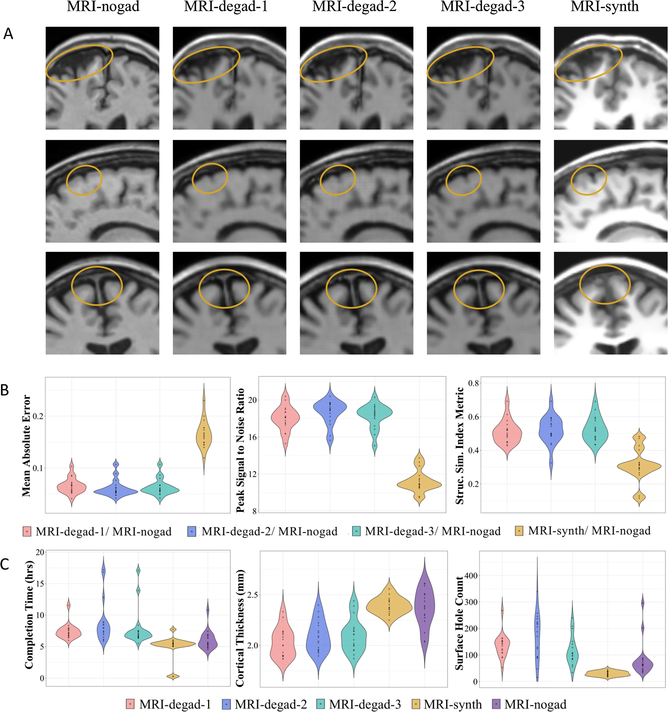
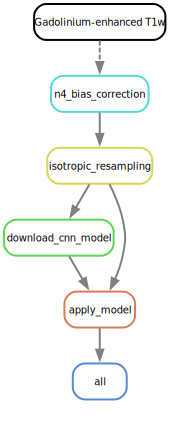

# MRI-Degad: Conversion of gadolinium-enhanced T1-weighted MRI to non-gadolinium T1-weighted scans

AIMS Lab Research Team at the Robarts Research Institute - 2024-2025

*This package is under active development. It should be stable and reproducible, but please let any of the active contributing members know if there are any bugs or unusual behaviour.*

This Python package is a standard 3D [U-Net](https://arxiv.org/abs/1505.04597) (Ronneberger et al. 2015) machine learning model based on Snakemake and SnakeBIDS workflow management tools, trained on a database containing gadolinium-enhanced T1-weighted MRI and non-gadolinium T1-weighted scans. It is currently in development phase and contains tunable parameters that are not normally exposed in most other machine learning models; the user is highly advised to get familiar with the above mentioned workflow managaments tools and read docstrings and relevant documentation before using this software.

## Workflow

A brief summary of the workflow can be found below along with its Directed Acyclic Graph (DAG) (see documentation for a detailed summary):

1. Preprocess input NIfTI T1w gadolinium enhanced files (n4 bias correction, isotropic 1mm voxel resampling)
2. Download and apply the Degad model 

### **Full documentation:** [here](https://mri-degad.readthedocs.io/en/latest/)

## Revalent Papers: 
* Ogunsanya F, Taha A, Gilmore G, Kai J, Kuehn T, Thurairajah A, Tenorio MC, Khan AR, Lau JC.  
  [MRI-degad: toward accurate conversion of gadolinium-enhanced T1w MRIs to non-contrast-enhanced scans using CNNs](https://doi.org/10.1007/s11548-024-03186-z).  
  *International Journal of Computer Assisted Radiology and Surgery*. 2024 Jul;19(7):1469-1472. doi: 10.1007/s11548-024-03186-z. Epub 2024 Jun 1. PMID: 38822981.

## Questions, Issues, Suggestions, and Other Feedback
Please reach out if you have any questions, suggestions, or other feedback related to this software—either through email (msnyde26@uwo.ca) or the discussions page. Larger issues or feature requests can be posted and tracked via the issues page.