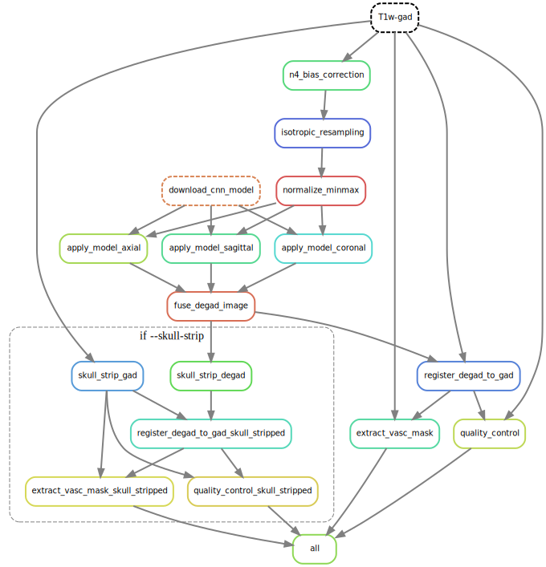

# Workflow Details

This section describes the mri_degad workflow (i.e. steps taken to produce 
intermediate and final files). mri_degad is a 
[Snakemake](https://snakemake.readthedocs.io/en/stable/) workflow, and thus a 
directed acyclic graph (DAG) that is automatically configured based on a set of 
rules.

## Overall workflow

Below is an image exhibiting the workflow DAG. Each rounded rectangle underneath the gadolinium-enhanced T1w modality input row in 
the DAG represents a rule (i.e. some code or script that produces an output), 
with arrows representing the connections (i.e. inputs / outputs) to these rules.

1. Preprocess input NIfTI T1w gadolinium enhanced files (n4 bias correction, isotropic 1mm voxel resampling, min/max normalization)
2. Download and apply the Degad model in the axial, sagittal, and coronal direction
3. Fuse the image 
4. Register the degad fused image to the gad image
5. Extract the vasculature mask

## Apply
Use the classic BIDS App syntax to generate vascular maps between the gad and degad image and a qc plot between the gad and degad image. For other derivative outputs, the following flag is supported: 

`--skull-strip`: This flag produces a skull-stripped vascular map between the gad and degad image and a qc plot between the skull-stripped gad and degad image. Please note: in order to use the --skull-strip flag, Freesurfer must be installed on your local machine as this pipeline uses `synthstrip` from Freesurfer. To utilize this flag, please follow the instructions in from `synthstrip` [Here](https://surfer.nmr.mgh.harvard.edu/docs/synthstrip/) . 

